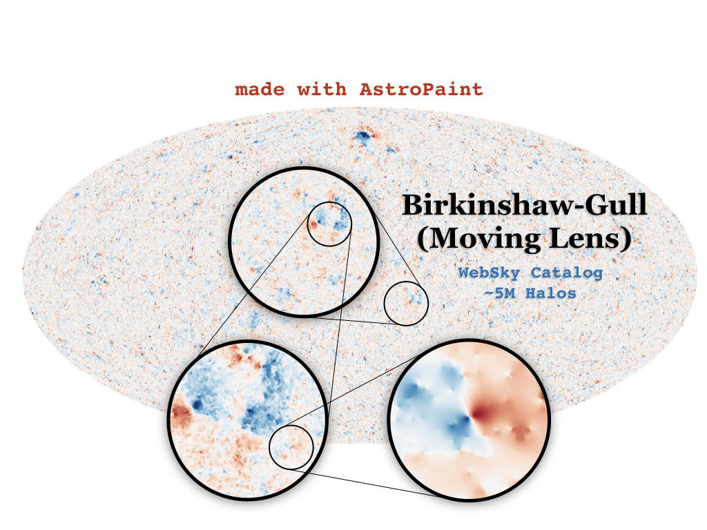

# AstroPaint
_A python package for creating mock maps of astrophysical signals from a halo catalog_

You can install **AstroPaint** by running the following in the command line:

`git clone https://github.com/syasini/AstroPaint.git`

`cd AstroPaint`

`pip install [-e] .` 

the `-e` argument will install the package in editable mode which is suitable for developement. If you want to modify the code use this option.


# Workflow

Converting catalogs to mock maps with AstroPaint is extremely simple. Here is what an example session looks like:

```python
from astropaint import Catalog, Canvas, Painter

catalog = Catalog(data=your_input_data)

canvas = Canvas(catalog, nside)

painter = Painter(template=your_radial_profile)

painter.spray(canvas)
```

That's it! Now you can check out your masterpiece using

`canvas.show_map()`




# How to contribute

If you would like to contribute to AstroPaint, take the following steps:

1) Fork this repository
2) Clone it on your local machine
3) Create a new branch (be as explicit as possible with the branch name)
4) Add and Commit your changes to the local branch
5) Push the branch to your forked repository
6) Submit a pull request on this repository

See [this repository](https://github.com/firstcontributions/first-contributions) for more detailed instructions. 

Developement happens on the `develop` branch, so make sure you are always in sync with the latest version and submit your pull requests to this branch. 

