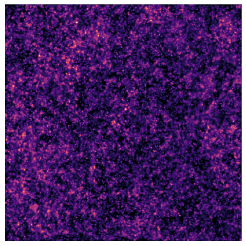
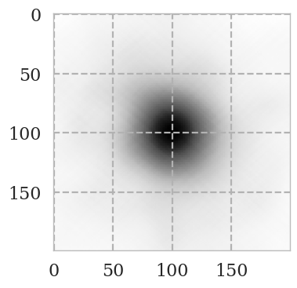
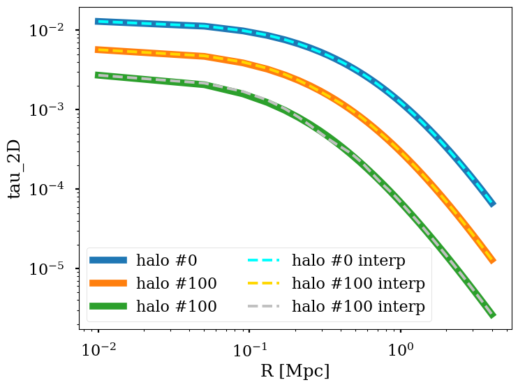
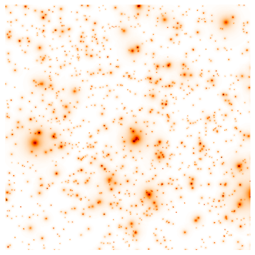
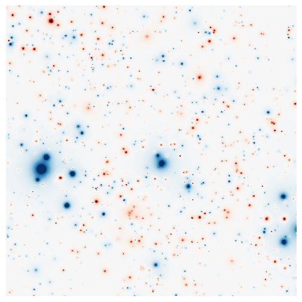
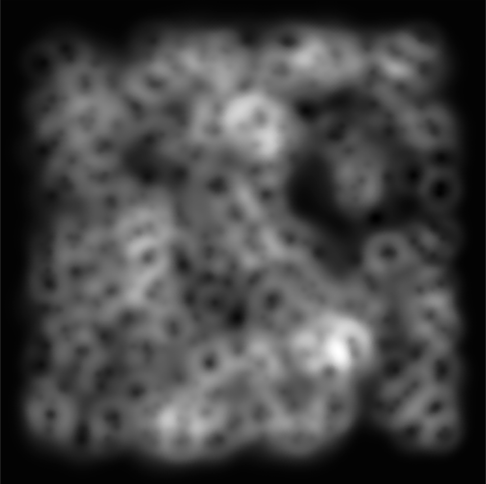
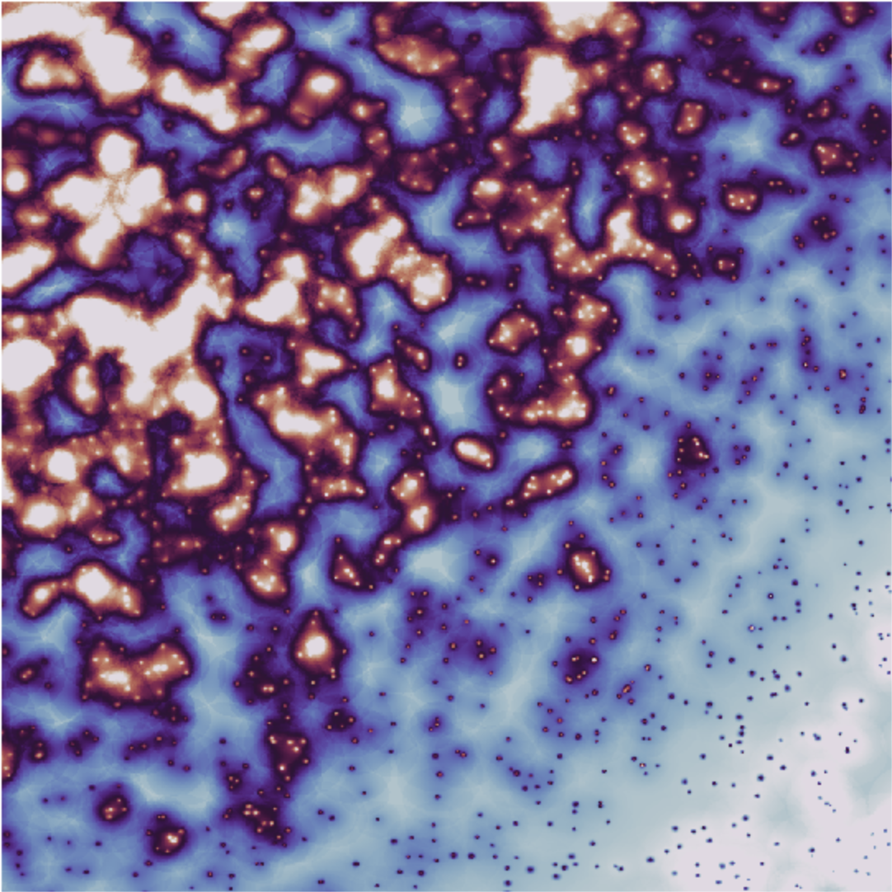

.. AstroPaint documentation master file, created by
   sphinx-quickstart on Tue Sep  8 14:47:06 2020.
   You can adapt this file completely to your liking, but it should at least
   contain the root `toctree` directive.
.. role:: raw-html-m2r(raw)
   :format: html

.. image:: ./images/logo.PNG
   :target: ./images/logo.PNG
   :height: 250

AstroPaint
==========

*A python package for painting the sky*

.. image:: https://mybinder.org/badge_logo.svg
   :target: https://mybinder.org/v2/gh/syasini/AstroPaint/master?filepath=tutorial.ipynb
   :alt: Binder

You can install **AstroPaint** by running the following in the command line:

``git clone https://github.com/syasini/AstroPaint.git``

``cd AstroPaint``

``pip install [-e] .``

the ``-e`` argument will install the package in editable mode which is suitable for developement. If you want to modify the code use this option.

**Important Note**:
If you want the sample catalogs to be cloned automatically along with the
rest of the repository, make sure you have `Git Large File Storage (git lfs) <https://git-lfs.github.com/>`_ installed.

If you are a conda user, please consider creating a new environment before installation:

 ``conda create -n astropaint python=3.7``

 ``conda activate astropaint``

Workflow
========

Converting catalogs to mock maps with AstroPaint is extremely simple. Here is what an example session looks like:

.. code-block:: python

   from astropaint import Catalog, Canvas, Painter

   catalog = Catalog(data=your_input_data)

   canvas = Canvas(catalog, nside)

   painter = Painter(template=your_radial_profile)

   painter.spray(canvas)

That's it! Now you can check out your masterpiece using

``canvas.show_map()``

.. image:: ./images/BG_websky_cover.png
   :target: ./images/BG_websky_cover.png
   :alt: BG

What is AstroPaint?
===================
AstroPaint is a python package for generating and visualizing sky maps of a wide range of astrophysical signals
originating from dark matter halos or the gas that they host. AstroPaint creates a whole-sky mock map of the target
signal/observable, at a desired resolution, by combining an input halo catalog and the radial/angular profile of the
astrophysical effect. The package also provides a suite of tools that can facilitate analysis routines such as catalog
filtering, map manipulation, and cutout stacking. The simulation suite has an Object-Oriented design and runs in
parallel, making it both easy to use and readily scalable for production of high resolution maps with large underlying
catalogs. Although the package has been primarily developed to simulate signals pertinent to galaxy clusters, its
application extends to halos of arbitrary size or even point sources.

Package Structure
=================

See our `documentation <https://astropaint.readthedocs.io/>`_ and `this chart <https://www.mindmeister.com/1417665103/astropaint-astropaint-py?fullscreen=1>`_
to understand the package structure and see what methods are available so far.

Examples
========

Nonsense Template
-----------------

Here's an example script that paints a nonsense template on a 10 x 10 [sqr deg]
patch of the ``Sehgal`` catalog:

.. code-block:: python

   import numpy as np
   from astropaint import Catalog, Canvas, Painter

   # Load the Sehgal catalog
   catalog = Catalog("Sehgal")

   # cutout a 10x10 sqr degree patch of the catalog
   catalog.cut_lon_lat(lon_range=[0,10], lat_range=[0,10])

   # pass the catalog to canvas
   canvas = Canvas(catalog, nside=4096, R_times=5)

   # define a nonsense template and plot it
   def a_nonsense_template(R, R_200c, x, y, z):

       return np.exp(-(R/R_200c/3)**2)*(x+y+z)

   # pass the template to the painter
   painter = Painter(template=a_nonsense_template)

   # plot the template for halos #0, #10, and #100 for R between 0 to 5 Mpc
   R = np.linspace(0,5,100)
   painter.plot_template(R, catalog, halo_list=[0,10,100])

.. image:: ./images/a_random_template.png
   :target: ./images/a_random_template.png
   :height: 300
   :align: center

The painter automatically extracts the parameters `R_200c` and `x,y,z`
coordinates of the halo from the catalog that the canvas was initialized
with. Let's spray ths canvas now:

.. code-block:: python

   # spray the template over the canvas
   painter.spray(canvas)

   # show the results
   canvas.show_map("cartview", lonra=[0,10], latra=[0,10])

*Voila!*

You can use the `n_cpus` argument in the spray function to paint in parallel and speed things up!
Setting `n_cpus=-1` uses all the available cpus.

.. image:: ./images/parallel.gif
   :target: ./images/parallel.gif
   :height: 450
   :align: center

Stacking
--------

You can easily stack cutouts of the map using the following:

.. code-block:: python

   deg_range = [-0.2, 0.2] # deg
   halo_list = np.arange(5000) # stack the first 5000 halos

   # stack the halos and save the results in canvas.stack
   stack = canvas.stack_cutouts(halo_list=halo_list, lon_range=deg_range, lat_range=deg_range)

   plt.imshow(canvas.stack)

If this is taking too long, use `parallel=True` for *parallel stacking*.

Line-Of-Sight integration of 3D profiles
----------------------------------------

AstroPaint only allows you to paint 2D (line-of-sight integrated) profiles on
your catalog halos, so if you already have the analytical expression of
the projected profile you want to paint, we are in business. However, not
all 3D profiles can be LOS integrated analytically (e.g. generalized NFW
or Einasto, etc), and integrating profiles numerically along every
single LOS is generally expensive. In order to alleviate this problem, AstroPaint offers two python decorators
`@LOS_integrate` and `@interpolate` which make 3D -> 2D projections effortless.

To convert a 3D profile into a 2D LOS integrated profile, all you need to do
is add the `@LOS_integrate` to the definition.

For example, here's how you can turn a 3D top hat profile

.. code-block:: python

   def tophat_3D(r, R_200c):
       """Equals 1 inside R_200c and 0 outside"""

       tophat = np.ones_like(r)
       tophat[r > R_200c]=0

       return tophat

into a 2D projected one:

.. code-block:: python

   from astropaint.lib.utilities import LOS_integrate

   @LOS_integrate
   def tophat_2D(R, R_200c):
       """project tophat_3D along the line of sight"""

       return tophat_3D(R, R_200c)

This function integrates the `tophat_3D` function along every single line of
sight. If you have many halos in a high resolution map, this can take
forever. The trick to make this faster would be to integrate along a
several LOSs and interpolate the values in between. This is what the
`@interpolate` decorator does. So, a faster version of the `tophat_2D`
function can be constructed as the following:

.. code-block:: python

   from astropaint.lib.utilities import interpolate

   @interpolate(n_samples=20)
   @LOS_integrate
   def tophat_2D_interp(R, R_200c):
       """project and interpolate tophat_3D along the line of sight"""

       return tophat_3D(R, R_200c)

This is much faster, but the speed comes at a small price. If your 3D profile
is not smooth, the interpolated 2D projection will slightly deviate from the
exact integration.

.. image:: ./images/tophat_interp.png
   :align: center
   :height: 300

You can minimize this deviation by increasing the `n_samples` argument of the
`@interpolate` decorator, but that will obviously decrease the painting speed.

Does this plot agree with what you would expect a LOS integrated top hat
profile (a.k.a. a solid sphere) to look like?

Painting Optical Depth and kSZ Profiles on the WebSky Catalog
-------------------------------------------------------------
Let's use the `Battaglia16` gas profiles to paint tau (optical depth) and
kinetic Sunyaev-Zeldovich (kSZ) on the WebSky catalog halos.

.. code-block:: python

   from astropaint.profiles import Battaglia16

    tau_painter = Painter(Battaglia16.tau_2D_interp)

Since the shape of the profile is smooth, we won't lose accuracy by using the interpolator.

Let's paint this on a 5x5 sqr deg patch of the WebSky catalog with a mass
cut of 8E13 M_sun.

.. code-block:: python

   catalog = Catalog("websky_lite_redshift")
   catalog.cut_lon_lat(lon_range=[5,10], lat_range=[5,10])
   catalog.cut_M_200c(8E13)

   canvas = Canvas(catalog, nside=8192, R_times=3)

   tau_painter.spray(canvas)

The `Battaglia16.kSZ_T` function uses this tau and multiplies it by the
dimensionless velocity of the halos to get the kSZ signal.

.. code-block:: python

   kSZ_painter = Painter(Battaglia16.kSZ_T)
   kSZ_painter.spray(canvas)

And here is what it looks like:

Art Gallery
===========

Just because AstroPaint is developed for probing new science and doing
serious stuff, it doesn't mean you can't have fun with it! Check out our
`cool web app <https://astropaint-art-gallery.herokuapp.com/>`_ to get your
hands dirty with some paint.

**Made with AstroPaint**

|img1| |img2| |img3|

How to contribute
=================

If you would like to contribute to AstroPaint, take the following steps:

1) Fork this repository
2) Clone it on your local machine
3) Create a new branch (be as explicit as possible with the branch name)
4) Add and Commit your changes to the local branch
5) Push the branch to your forked repository
6) Submit a pull request on this repository

See `this repository <https://github.com/firstcontributions/first-contributions>`_ or `Kevin Markham's step-by-step guide <https://www.dataschool.io/how-to-contribute-on-github/>`_ for more detailed instructions.

Developement happens on the ``develop`` branch, so make sure you are always in sync with the latest version and submit your pull requests to this branch.

.. toctree::
   :maxdepth: 2
   :caption: Contents:

   source/modules.rst

Indices and tables
==================

* :ref:`genindex`
* :ref:`modindex`
* :ref:`search`
